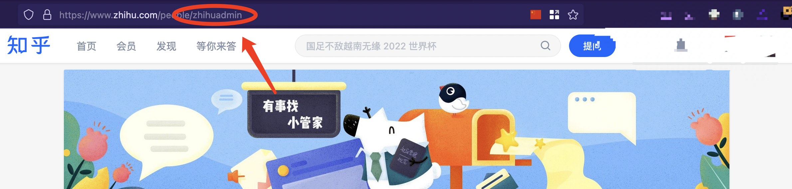
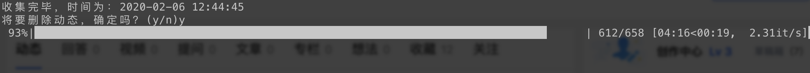

# Zhihu-Spider

## 介绍

>知乎爬虫，可以爬取特定用户的全部动态。<br/>
>鉴于知乎对用户隐私的漠视（动态没法隐藏😇），所以我添加了批量删除动态的功能。


## 使用说明

```
python zhihuCollector.py --help

    -h --help                   帮助文档
    -u --username               用户名
    -c --cookie                 你的Cookie
    -d --delete                 是否选择删除动态（删除动态必须保证Cookie有效）
```

### 动态爬取

#### 命令行执行

```python3 zhihuCollector.py -u zhihuadmin```

```username```参数从该用户知乎主页的url获得，以知乎小管家为例：
```https://www.zhihu.com/people/zhihuadmin```此时```zhihuadmin```即为用户名。





执行完成后会在当前页面生成csv文件。

### 动态批量删除

#### 命令行执行

``` python3 zhihuCollector.py --username zhihuadmin --delete True --cookie 'Your Cookie'```


